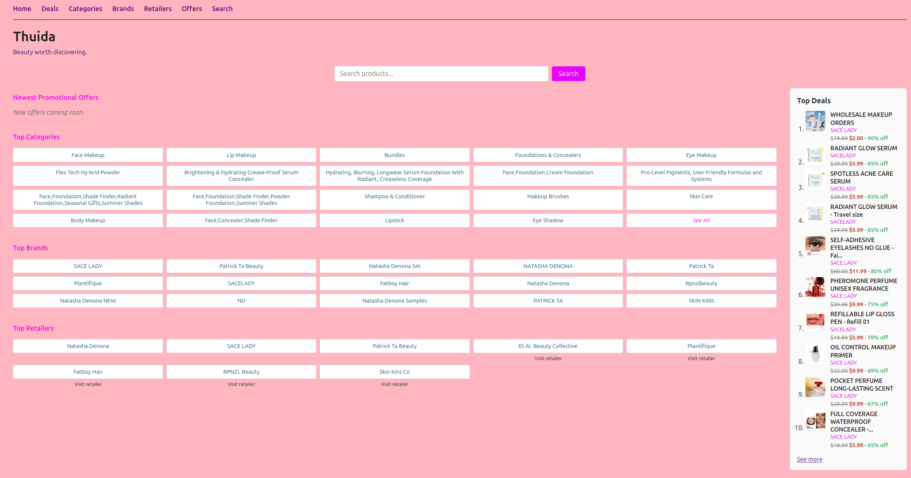

# commerce-engine

A pipeline for pulling product catalogs from affiliate feeds into a
local SQLite database, ready to power search, filtering, and
browsing on top of it.

Built around Impact.com's affiliate network specifically -- FTP
catalog delivery, their standardized Impact Radius (IR) column
format, and their catalog-metadata API for change detection. That
integration is deliberately isolated to one file
(`common-lisp/impact-parser.lisp`) and one shell script
(`shell/update-onp.sh`); everything downstream of a parsed
`product` struct -- the schema, the SQLite persistence layer, the
retailer-onboarding pattern -- has no dependency on Impact.com. 
Swapping in a different affiliate network or a direct merchant feed 
would mean replacing that one parsing layer, not rearchitecting the 
rest.

## Architecture

- **`common-lisp/impact-parser.lisp`** -- parses Impact Radius
  format rows into a generic `product` struct. This is the one file
  that knows about Impact.com's specific column layout.
- **`common-lisp/product.lisp`** -- the `product` struct, and a
  column-spec-driven SQLite layer (`db-builder.lisp`) that generates
  `CREATE TABLE`/`INSERT` statements from one declarative list, so
  the schema and the queries built against it can't silently drift
  out of sync with each other.
- **`common-lisp/retailers/catalogs.lisp`** -- one `load-<name>`
  function per retailer that needs no custom parsing beyond the
  standard columns. Onboarding a new retailer here is two small,
  mechanical additions, not new logic.
- **`shell/update-onp.sh`** -- checks every retailer's catalog
  against Impact's own `lastUpdated` metadata, downloads and
  archives only what actually changed, and reloads the database for
  that retailer. Idempotent by design -- safe to run daily, or
  fifty times in a row, without duplicating work.
- **Retailers needing non-standard parsing** (e.g. quantity
  information embedded in a product name, like "16 oz" or "Case of
  24") get their own dedicated wrapper file instead of forcing that
  logic into the generic path -- see `RUNBOOK.txt` for the pattern.

## Quickstart

1. Impact.com FTP credentials go in `~/.netrc`, `chmod 600` -- this
   isn't committed and needs setting up per machine.
2. `cd commerce-engine && bash shell/update-onp.sh` -- pulls the
   sample retailer's catalog and loads it into `database/impact.db`.

## Day-to-day operations

See `commerce-engine/RUNBOOK.txt` -- running the full update,
reloading one retailer manually, checking the database, recovering
from a schema change.

## In production

This is the backend for [Thuida](https://www.thuida.com/), a live
beauty-product discovery and price-comparison site pulling from
several real Impact.com retailer feeds through this same pipeline.

